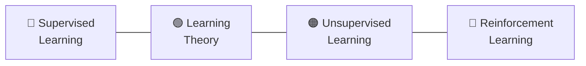

# CS229 Syllabus and Calendar - Summer 2026

**Instructors:** Jehangir Amjad, Anand Avati
**Schedule:** Tue & Thu, 4:30 PM – 6:15 PM, NVIDIA Auditorium
**Course Notes:** [main_notes.pdf](https://cs229.stanford.edu/main_notes.pdf)

---

## Prerequisites Checklist

Before diving in, ensure you're comfortable with:
- [ ] **Linear Algebra** — Matrix operations, eigenvalues/eigenvectors, SVD (review: [CS229 Linear Algebra Review](https://cs229.stanford.edu/section/cs229-linalg.pdf))
- [ ] **Probability & Statistics** — Distributions, expectations, Bayes' rule (review: [CS229 Probability Review](https://cs229.stanford.edu/section/cs229-prob.pdf))
- [ ] **Multivariable Calculus** — Partial derivatives, gradients, Hessians
- [ ] **Python & NumPy** — Comfortable writing non-trivial code

---

## Week-by-Week Schedule

| Week | Lectures | Topics | Readings / Notes | Assignments |
|---|---|---|---|---|
| 1 | L1, L2 | **Introduction to ML & Supervised Learning.** What is ML? Types of learning. Linear Regression — hypothesis, cost function $J(\theta)$, the Normal Equation. | Main Notes: Ch 1 (Supervised Learning Setup) | PS0 (Diagnostic) out |
| 2 | L3, L4 | **Gradient Descent & Logistic Regression.** Batch vs. Stochastic GD. Classification — sigmoid function, decision boundary, maximum likelihood estimation. | Main Notes: Ch 1 (cont.), Ch 2 (Classification) | PS0 due, PS1 out |
| 3 | L5, L6 | **Generalized Linear Models (GLMs) & Generative Learning.** Exponential family. Softmax regression. Gaussian Discriminant Analysis (GDA). | Main Notes: Ch 3 (GLMs), Ch 4 (GDA) | |
| 4 | L7, L8 | **Naive Bayes & Support Vector Machines.** Text classification, Laplace smoothing. Optimal margin classifier, functional/geometric margins. | Main Notes: Ch 4 (Naive Bayes), Ch 6 (SVMs) | PS1 due, PS2 out |
| 5 | L9, L10 | **SVMs (cont.) & Kernels.** Lagrange duality, KKT conditions. Kernel trick — polynomial, RBF kernels. Soft-margin SVM. | Main Notes: Ch 6 (cont.), Ch 7 (Kernels) | |
| 6 | L11, L12 | **Neural Networks & Deep Learning.** Perceptron, multi-layer networks, activation functions. Backpropagation algorithm. Training strategies. | Main Notes: Ch 8 (Neural Networks) | PS2 due, PS3 out |
| 7 | L13, L14 | **Learning Theory & Regularization.** Bias/variance tradeoff. Empirical risk minimization. Union bound, Hoeffding's inequality. VC dimension. Regularization (L1, L2). | Main Notes: Ch 5 (Learning Theory) | |
| 8 | L15, L16 | **Unsupervised Learning I.** K-Means clustering. Mixture of Gaussians. Expectation-Maximization (EM) algorithm — E-step, M-step, convergence. | Main Notes: Ch 9 (EM), Ch 10 (Clustering) | PS3 due, PS4 out |
| 9 | L17, L18 | **Unsupervised Learning II & Dimensionality Reduction.** Factor Analysis. Principal Components Analysis (PCA). Independent Components Analysis (ICA). | Main Notes: Ch 11 (PCA), Ch 12 (ICA) | |
| 10 | L19, L20 | **Reinforcement Learning.** Markov Decision Processes (MDPs). Bellman equations. Value iteration, Policy iteration. Q-Learning. LQR. Course wrap-up & review. | Main Notes: Ch 13 (RL) | PS4 due, Final Project due |

---

## Four Pillars of CS229

### Pillar 1: Supervised Learning (Weeks 1–6)
> Given labeled data $(x, y)$, learn a mapping $f: x \rightarrow y$
- Linear & Logistic Regression, GLMs
- Generative models (GDA, Naive Bayes)
- SVMs & Kernels
- Neural Networks

### Pillar 2: Learning Theory (Week 7)
> How well does our model *generalize* to unseen data?
- Bias/Variance, Regularization
- VC Dimension, PAC Learning

### Pillar 3: Unsupervised Learning (Weeks 8–9)
> Find structure in *unlabeled* data
- Clustering (K-Means, GMMs)
- Dimensionality Reduction (PCA, ICA)
- EM Algorithm

### Pillar 4: Reinforcement Learning (Week 10)
> Learn to act optimally through *rewards*
- MDPs, Bellman Equations
- Value/Policy Iteration, Q-Learning
