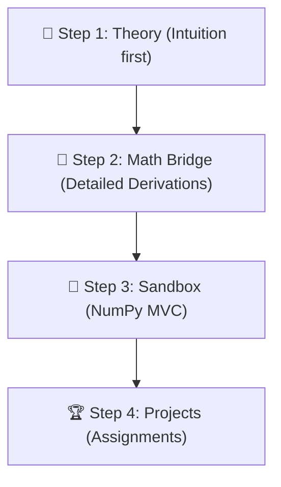

# 🚀 CS229 Study & Teaching Workflow Guide

This guide establishes the exact rules, expectations, and learning loop that we (student and AI teacher) will follow to conquer Stanford CS229.

---

## 🎓 Our Teaching & Learning Style

We use a **Micro-Lesson & Active Verification** approach. We do not do massive information dumps. Instead:
1. **Step-by-Step Delivery:** The AI teacher presents a single, focused sub-concept (e.g., just the intuition of a cost function, or just a single vector derivative step).
2. **Active Checkpoint:** After every short lesson, the AI teacher presents a mini-question, a brief derivation challenge, or a small coding exercise.
3. **Verification:** You respond or write code. Once we verify it's correct, we move to the next sub-concept.
4. **Permanent Progress Logging:** We track every step in the `00_Dashboard.md` file so we never lose our place between sessions.

---

## 🔄 The 4-Step Module Pipeline

For every topic in the syllabus, we follow this strict progression:

### 📖 Step 1: Pre-read & Theory (`/theory`)
* **Objective:** Understand the "why" and "what".
* **Process:** Create/open the lecture note file (e.g., `theory/01_Linear_Regression.md`) using `theory/lecture_template.md`. We discuss the high-level intuition and add new vocabulary to `theory/00_Glossary.md`.
* **Standard:** Zero complex math formulas at this stage. Focus on the core objective.

### 🌉 Step 2: The Math Bridge (`/bridge`)
* **Objective:** Bridge the gap between intuition and raw code through derivation.
* **Rigorous Standards:**
  * **Vector Calculus:** Write out the cost functions $J(\theta)$ and calculate gradients ($\nabla_\theta J(\theta)$) and Hessians ($H$) step-by-step using matrix derivatives.
  * **Exponential Family:** For generative and generalized linear models (GLMs), derive the parameter distributions mathematically from scratch.
  * **Proof Verification:** We mathematically prove concepts (like why Newton's Method converges on quadratic objectives in one step) before programming them.

### 🧪 Step 3: Minimal Viable Code / Sandbox (`/lab/sandbox`)
* **Objective:** Program the math derivations into pure NumPy.
* **Rigorous Standards:**
  * **Zero High-Level ML Libraries:** Do not use `scikit-learn` or other wrapper libraries. We implement calculations directly using `numpy` operations (e.g., `@`, `np.dot`, `np.linalg.inv`).
  * **Vectorization:** No loops (`for` or `while`) for matrix operations unless absolutely required. Everything must be vectorized to leverage linear algebra speed.
  * **Mini-Dataset Test:** Write a small script or Jupyter Notebook (`.ipynb`) in `lab/sandbox/` running on 5–10 data points to print cost updates and plot decision boundaries using `matplotlib`.

### 🏆 Step 4: Final Projects & Assignments (`/lab/projects`)
* **Objective:** Tackle the official CS229 problem sets.
* **Process:** Apply our verified sandbox implementation to full-scale datasets and formal problem assignments.

---

## 📝 How We Log Progress (Session Memory)

At the end of every study session, we update two files to ensure continuity:
1. **[00_Dashboard.md](file:///C:/Users/HP/OneDrive/Desktop/stanford-cs229-deep-dive/00_Dashboard.md):** Mark sub-stages (Theory, Bridge, Sandbox) as ⬜ (Not Started), 🟡 (In Progress), or ✅ (Done) and set your confidence scale (1-5).
2. **Current Session Log:** We will append a quick status note at the bottom of this file (`WORKFLOW_GUIDE.md`) detailing:
   * What we finished today.
   * Exactly what micro-lesson/concept is next.
   * Any open questions or points of confusion.

---

## 📌 Current Session Status & Next Steps

* **Current Topic:** Step 0: Mathematical Foundations
* **Last Completed Action:** Initial curriculum setup and pushing to GitHub.
* **Next Action/Lesson:** Lesson 0.1: Checkpoint 0.1 (Matrix dimensions practice - $X\theta$ and $\theta X$). No lecture has been delivered yet; we will start fresh with Lesson 0.1 when you return.
